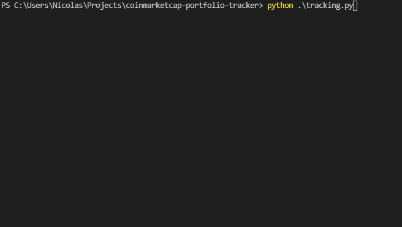

<h1 align="center">
  <br>
  <a href="https://coinmarketcap.com/"></a>
  <br>
  CoinMarketCap Portfolio Tracker
  <br>
</h1>

<h4 align="center">A simple tracker that collects coins from major portfolios listed on <a href="https://coinmarketcap.com/view/alameda-research-portfolio/" target="_blank">CoinMarketCap</a> between a specific market cap range.</h4>

<p align="center">
  <a href="#key-features">Key Features</a> •
  <a href="#how-to-use">How To Use</a> •
  <a href="#download">Download</a> •
  <a href="#credits">Credits</a> •
  <a href="#related">Related</a> •
  <a href="#license">License</a>
</p>

<p align="center">
  
</p>

## Key Features

- Selects the market cap range
- Exports output as pandas DataFrame
- Gets the occurrence of coins

## How To Use

To clone and run this application, you'll need [Git](https://git-scm.com) and [Python3](https://www.python.org/downloads/) installed on your computer. From your command line:

```bash
# Clone this repository
$ git clone https://github.com/nicolaspons/coinmarketcap-portfolio-tracker

# Go into the repository
$ cd coinmarketcap-portfolio-tracker

# Create a virtual env (for this example I'll use conda)
$ conda create --name myenv

# Activate the virtual env (for this example I'll use conda)
$ conda activate myenv

# Install the packages (for this example I'll use conda)
$ conda install --file requirements.txt

# Run the script
$ python tracking.py --min=<MIN_MARKET_CAP> --max=<MIN_MARKET_CAP> -s
```

Note: the options _min, max_ and _save_ are optional.

## License

MIT
